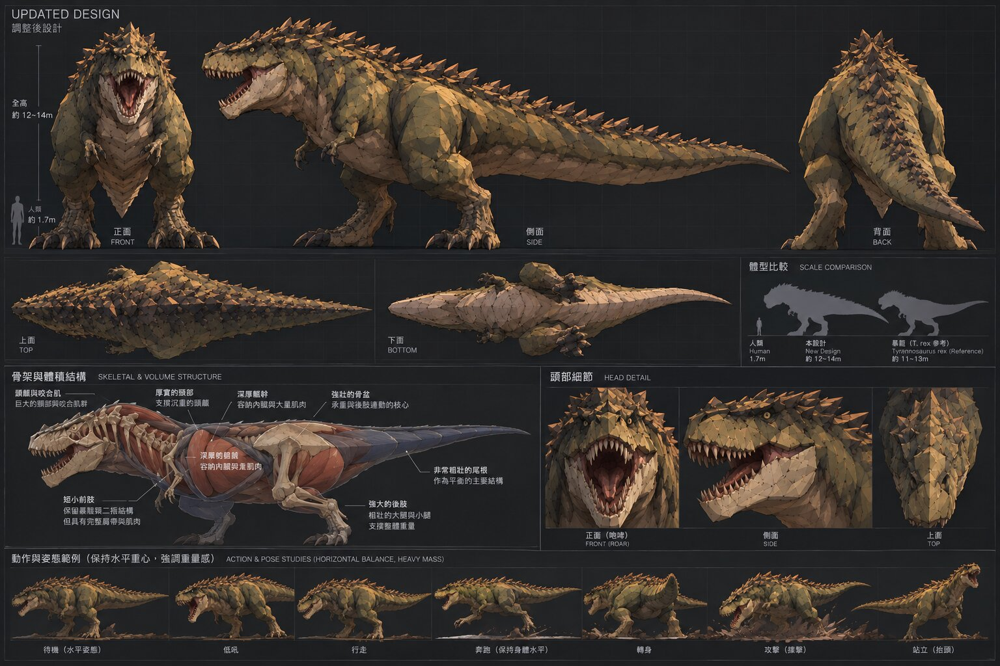
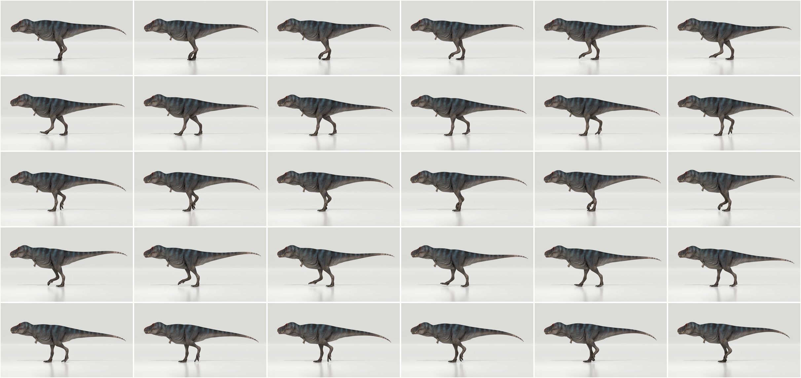

# 尼諾拉（Ninola，簡稱 Nina）

遊戲裡的那隻大恐龍。設定由 NIBA（gio_cpy）在 2026-10-02 的 DC「要素想法」串分享，這份是整理和製作規格。
原文照存：[`docs/ninola/NIBA_行為參考.md`](ninola/NIBA_行為參考.md)、[`docs/ninola/NIBA_AI行為設計命令.md`](ninola/NIBA_AI行為設計命令.md)。

> **一句話：牠是一隻玩家逐漸可以理解，但永遠無法完全放心自己已經理解的巨大掠食者。**
> 動物性讓玩家相信牠活著；怪獸性負責讓玩家偶爾懷疑：這東西可能不只是一隻動物。

## 基本設定

| 項目 | 設定 | 目前遊戲裡 |
|---|---|---|
| 名字 | 尼諾拉 Ninola，順口叫 Nina | 程式裡叫 boss／trex |
| 性別 | 生理女性 | — |
| 全長 | 12～14 公尺 | 12.9 公尺 ✅ |
| 肩高 | 3.5～4.5 公尺 | 髖關節只有 2.6 公尺 ❌ 腿太短 |
| 頭高 | 5～6 公尺（抬頭） | 外框高 5.3 公尺 |
| 形象 | 偏真實生物，不走奇幻；類暴龍、背上一排棘刺、面狀低多邊形 | 同方向 |
| 顏色 | 橄欖綠／苔綠，腹部淡黃褐 | ⚠️ 2026-10-02 為了跟樹分開改成冷灰綠（`trex.gd` 的 `RECOLOR`），**跟設定衝突，待決定** |

設定圖：



製作參考（骨架、肌肉、體積分區、綁骨關節、關節活動範圍、頭部和口腔、動作姿勢）：
[1](image/ninola/製作參考_1.jpg)、[2](image/ninola/製作參考_2.jpg)、[3](image/ninola/製作參考_3.jpg)、[4](image/ninola/製作參考_4.jpg)

## 骨架規格（重建用）

### 現在的骨架（`blender/trex_hd.py` 的 `bone_table`，程式動畫在 `trex.gd`）

```
root ─ spine1 ─ spine2 ─ neck ─ neck2 ─ head ─ jaw
     │                 └ arm ─ forearm ─ hand ─ finger1~3   （左右）
     ├ tail1 ~ tail8
     └ thigh ─ shin ─ foot ─ toe1~3（各兩節）、dew           （左右）
```

### 參考圖的骨架和差異

| 部位 | 參考圖 | 現在 | 要改 |
|---|---|---|---|
| 腿長 | 肩高 3.5～4.5 m，腿是撐起全身的主要結構 | 髖 2.6 m | **加長腿**，髖約 3.6～3.8 m（全長不變）。碰撞、鏡頭、攻擊距離要跟著調 |
| 骨盆 | 獨立的「承重核心」，重心在骨盆前 | root 兼骨盆 | root 當重心，另外分出 pelvis（腿和尾巴掛在它下面） |
| 胸椎 | 2～3 節 | spine1、spine2 | 加 chest 一節（手掛在這裡），軀幹扭轉才分得出段 |
| 頸 | 多段、粗短、肌肉厚 | 2 節 | 3 節，頭的上下 +45°／−35°、左右 ±60° 分攤到三節 |
| 下顎 | 張口 65～80° | jaw 一根 | 照舊，張口上限改 70° |
| 尾巴 | 多段可逐段彎曲，S 形自然曲線；上下 ±30°、左右 ±25～40° | 8 節 | 10 節（尾根粗、越尾越細越短），程式動畫的延遲傳遞照舊 |
| 前肢 | **二指**、短小但完整（肩、肘、腕、指），活動約 ±40° | 三指 | **改成兩指** |
| 後肢 | 髖、膝、踝、蹠、三前趾＋後趾；髖 −50～+130°、膝約 120°、踝 ±45° | 同結構 | 結構照舊，比例照參考圖重抓 |
| 控制點 | 腳和尾巴有 IK 控制 | 程式做（圓周 IK 步態） | 照舊用程式 |

骨頭名字盡量沿用（`root`、`neck`、`head`、`jaw`、`tail1…`、`thigh_l`…），`trex.gd` 的程式動畫才接得回去；新增的骨頭在程式裡補。

### 走路參考動畫

NIBA 給的走路參考：<https://www.youtube.com/watch?v=x_mQw10XN-0>（Tyrannosaurus rex Trix walking animation，30 秒）。
影片下載在 `docs/movie/ninola/walk_ref.mp4`（不進 git），**6～12 秒是乾淨的正側面**。



從影格量到的：

- **一步約 1.2 秒，一個完整循環（左右各一步）約 2.4 秒**（慢走）
- 身體幾乎保持水平，頭和尾巴是平衡的兩端；雙腳著地時身體微微下沉
- 抬起的腳**腳趾往下捲、腳掌收得很高**再往前伸；落地時腳趾先張開
- 膝蓋一直往前，步幅很大（前腳伸到頭的正下方附近）
- 尾巴跟著步伐左右小幅擺動，尾尖慢半拍

其他動作參考（NIBA 給的時間點）：

| 動作 | 影片 |
|---|---|
| 待機 | <https://youtu.be/pTf2XETAABw?t=77>（1:17～1:32） |
| 啃咬（準備→爆發→咬合→煞車） | 鱷魚 <https://youtu.be/5kuuayDtkgA?t=167>（2:47～5:09）；或 <https://youtu.be/pTf2XETAABw?t=275>（4:35～4:37） |
| 跑步 | 鴕鳥腳的感覺 <https://www.youtube.com/watch?v=FKweR72oGIc>；追車 <https://youtu.be/pTf2XETAABw?t=790>（13:10～13:15）、追小恐龍 13:51～13:55 |
| 吼叫聲 | <https://freesound.org/people/KevinSonger/sounds/689966/> |
| 腳步聲 | <https://motionarray.com/sound-effects/dinosaur-footsteps-1172881/> |

使用者決定先做 **走路、攻擊、待機** 三種。

### 走路（2026-10-03 第一版）

- 骨架：腿從腳掌往上拉長 0.75 模型單位（`blender/trex_hd.py` 的 `LEG_EXTRA`），腳以上整隻抬高；手改兩指。遊戲裡髖約 3.8 公尺
- 動畫（`trex.gd` 的 `_walk`）：腳掌支撐期釘在地上、擺動期抬起來畫弧；兩段 IK 由腳的位置反推大腿、小腿，膝蓋朝前；
  步伐相位跟著實際走過的距離跑（腳不滑）；抬腳時腳趾往下捲、支撐末段腳跟先抬
- 自我檢查：`godot --headless --path . --script tools/trex_walk_check.gd`（加 `OUT=圖.png` 和視窗會拍側面影格）

| 檢查 | 門檻 | 結果 |
|---|---|---|
| IK 準（腳掌離目標） | < 6 公分 | 0 |
| 腳不滑（支撐期水平移動） | < 5 公分 | 0 |
| 踩實地面／不穿地 | < 8／10 公分 | 0 |
| 抬腳高度（走、跑） | > 35 公分 | 63 公分 |
| 走路週期 | 1.3～2.2 秒 | 1.45 秒（遊戲走速 4 m/s，比參考動畫的慢走快） |
| 左右交替 | 40～60% | 50% |
| 膝蓋朝前 | 0 幀往後彎 | 0 |
| 髖高 | 3.4～4.1 公尺 | 3.78 公尺 |
| 停下來兩腳踩地 | 1 秒內 | ✅ |

檢視模式（`viewer.gd`）看到的「奇怪的動態」，用同樣的方式量到並修掉（一幀內腿關節最多轉 20～80 度、踩著的腳滑 1.4 公尺）：

| 原因 | 修法 |
|---|---|
| 抬腳那一刻腳背角度從「腳跟抬起」跳回 0 | 擺動從支撐末段的角度接著走；腳背角度平滑追 |
| 腳拉太遠時直接把腳搬回身體底下、或撥相位 | 改成加快步伐，讓它自然早點跨 |
| 起跑、急停時預測的落點一幀跳 9 公尺；走跑切換時半空中的腳被當成落地 | 預測用平滑速度、落點移動有速度上限；擺動中的腳照抬起時的比例走完 |
| 身體一下子被搬走（重生、檢視模式換位置）算成時速上百 | 一幀移動超過 1 公尺當瞬移：速度歸零、腳重新擺好 |
| 側移、轉彎時腿只會前後解，腳被身體橫拖 | 整條腿繞髖左右擺；側移時落點往旁邊放 |
| 檢視模式本身：恐龍只有遊戲裡 2/3 大、繞比腿還小的圈、斜著走 26 度 | 改成遊戲裡的大小、boss 走路速度、夠寬的 8 字，鏡頭跟著 |

走路檢查多了「踩著的腳不動」「抬起的腳不瞬移」「抬起的腳跟得上」「腿不抽（一幀 < 12 度）」四項，
以前全部 PASS 是因為沒量這些——腳的目標跳了，IK 照樣準，檢查就看不出來。

已知限制：原地快轉時踩著的腳會往旁邊滑一點（腿只能擺開 ±0.45）。

**2026-10-03 第二輪（照知識庫筆記）：**
- 出招的腿部動作不再疊在關節角度上（腳會離開踩的地方）：蹲、後坐、前衝改成移動身體，跺地、咬下去踏一步改成移動腳的目標（拱形抬起再放回）。撲擊預備蹲得淺一點（0.55 → 0.38）才不滑
- 身體高度和側傾跟著兩腳實際踩的高度；抬起的腳用它要落的地方，下坡時身體先沉
- 落點先往前推再找地面高度（坡上才不會差 推的距離 × 坡度）
- 腿快伸直時早點抬腳（腿伸直時膝蓋對腳的位置太敏感，一抬就甩）
- 卡頓保護：一幀最多算 0.05 秒
- 走路檢查加了「站著把九招做一遍」和「20 度坡上坡、轉身、下坡、橫走」；全部通過
- 檢視模式「操控恐龍」（C）：自己開、一鍵出招、心情、慢動作、腳踩的點（K）、斜坡台階石堆。
  `tools/trex_drive_check.gd` 照玩家按鍵的方式跑一遍。修掉的：檢視模式跟遊戲共用一個 3D 世界（腳會踩到藏起來的地形，
  找到的「地面」最高差 4.4 公尺，改成自己一個世界）；落點在懸崖邊外（一步最多往下 1.5 公尺）；落地時再貼一次地；
  撲出去時兩腳騰空收起、落地慢慢放；甩尾 0.4 秒轉一圈時腿凍住跟著轉、轉完慢慢放；咬下去的踏步跟著自己收完；
  跺地用不會歸零的時間；站著對相位時兩腳都排在踩地期；往上踩先抬高、路徑上有東西就抬高越過；
  腳被拖太遠時步伐加快（只有腿快伸直、原地轉身可以超過一般上限，不然遊戲裡跑步、側移的步伐會亂）
- **還沒解決**（操控檢查 3 項）：停下來同時快轉 90 度時，前面那隻腳在地上滑最多 1.7 公尺（0.5 秒轉 90 度，來不及跨）；
  腳踩在石頭邊緣時，量到穿地 0.25、懸空 0.22（腳掌一半在石頭上）
- 遊戲的自我檢查有三項是照舊的 sin 擺腿寫的（只假裝跑 6 幀、身體不動、側傾要回到 0），改成真的移動、跟原本的角度比
跟參考動畫比還差的（看 `image/ninola/走路對照.png`）：上半身比較直立、膝蓋彎得比較多（模型靜止姿勢就是蹲的），
參考是背平、腿比較直。這要改模型的靜止姿勢，不是動畫參數。

## 行為設計（NIBA 的願望，跟現在的比較）

目前的行為見 [`docs/恐龍行為.md`](恐龍行為.md)。

| NIBA 的設計 | 現在 | 差距 |
|---|---|---|
| **保護物**：生活在固定的巢附近，打獵有距離和時間限制，最後回來 | 滿場跑，導演帶路 | 新增。跟「玩法可能改成偷蛋」方向一致，保護物可能就是蛋 |
| **生活模式**：巡視、嗅聞、遠望、休息——玩家是闖進牠的生活 | 隨便逛 | 新增幾個生活小動作 |
| **狩獵週期**：生活一段時間後主動出去找人，範圍有限 | 導演的醞釀／退開／放鬆 | 改成以巢為中心 |
| **狩獵時安靜**：靠腳步、呼吸讓人察覺；完整吼叫留給「雙方確定看到彼此」 | 每次確定看到人就吼 | **衝突**，要改 |
| **攻擊只有兩招：啃咬、衝撞** | 三招（咬、橫掃衝撞、撲擊） | 要減 |
| 大動作後要有重量成本（咬空調整頭、撞空減速轉向） | 有預備和硬直 | ✅ 已有 |
| 記得玩家最後的位置，去那裡找，慢慢降低警戒 | 追 6 秒、聽聲音繞 5 秒 | ✅ 大致有，過渡可以拉長 |
| **被挑戰的反應**：停下、轉頭、看玩家、身體轉正，才進戰鬥 | 中彈晃一下 | 新增 |
| **怪獸異常**（低頻）：不自然的靜止、過度持久的凝視、瘋狂吼叫爆發（不可綁低血量） | 無 | 新增 |
| **規則偶爾失效**：多記一會、多搜一圈、準備離開時回頭 | 數字固定 | 新增小隨機 |

一次理想遭遇的節奏（NIBA 原文第十一節）：進入領域 → 看見牠在做自己的事 → 牠離開，你不知道牠去哪 →
遠處腳步呼吸 → 牠停下，你不知道有沒有被發現 → 視線交會 → 有時只是凝視、有時一聲巨吼 → 攻擊 →
閃過衝撞、牠要重新調整 → 你躲進掩體 → 牠沒走，走到你剛才的位置搜索 → 最後離開 → 某一次牠沒照你預期的時間走，轉回來了。

## 待決定

- **顏色**：照設定圖的橄欖綠，還是保留冷灰綠（跟樹分得開）？折衷：保留橄欖綠，靠輪廓光、深色外框、背光面加深分開
- **腿加長之後**：碰撞形狀、第三人稱鏡頭、攻擊距離、導航網格的高度都要跟著調
- **行為改版的順序**：先做骨架和三個動作，行為等骨架好了再排
